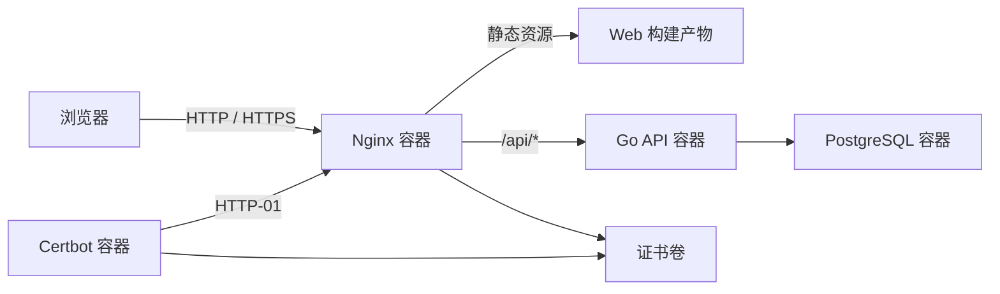

# Dezhonger Service

Dezhonger Service 是一套可独立部署的个人工具服务，包含浏览器端数学与代码工具、带离线队列的私人备忘录、用户管理 API，以及完整的 Docker Compose 部署配置。

## 功能

- 精确数学工具
  - 数论：素数判定、质因数分解、精确素数计数、GCD、LCM、Bézout 等式、模逆元和广义中国剩余定理。
  - 方程：二次、三次和四次方程的精确或高精度求解。
  - 矩阵：行列式、秩、迹、转置、RREF、逆矩阵、零空间、列空间、特征空间、PLU、LDU、LDLT、QR 和 SVD。
- 代码工具
  - 多语言代码注释去除。
  - 基于 Monaco Editor 的文本差异对比。
- 私人备忘录
  - Markdown 编辑与安全预览。
  - 自动保存、本地缓存和断网操作队列。
  - 搜索、标签、分类、状态、置顶、导入和导出。
  - 每个用户的数据严格隔离。
- 账号管理
  - 管理员创建用户、设置角色、停用账号和重置临时密码。
  - 不开放公开注册。
  - 临时密码首次登录后必须修改。

## 架构



数学和代码计算在浏览器内执行；服务器只负责静态文件、认证、用户管理和备忘录数据。

## 本地验证

```bash
cd web
npm ci
npm test
npm run build

cd ../api
go test ./...
go build ./cmd/api

cd ..
docker compose config
docker compose build
```

## 部署

服务器只需要 Git 与 Docker。部署目录推荐为 `~/service`。

```bash
git clone https://github.com/dezhonger/dezhonger_service.git ~/service
cd ~/service
cp .env.example .env
```

在 `.env` 中设置公网 IP、HTTPS Origin 和随机数据库密码，然后启动：

```bash
docker compose up -d --build
docker compose ps
curl http://127.0.0.1/api/healthz
```

创建首个管理员，密码不会写入仓库或环境文件：

```bash
docker compose run --rm -T api create-admin --username admin
```

命令从标准输入读取一次临时密码。管理员首次登录后必须修改密码。

## IP 地址 HTTPS

本项目使用 Certbot 5.7，并按 Let’s Encrypt 的要求为 IP 地址申请 `shortlived` 证书。证书有效期约六天，`certbot` 容器每六小时检查续期，Nginx 容器检测到证书变化后自动重新加载。

先用测试环境验证 HTTP-01：

```bash
set -a
. ./.env
set +a
STAGING=1 ./scripts/issue-certificate.sh
```

验证成功后申请正式证书：

```bash
./scripts/issue-certificate.sh
```

证书出现后 Nginx 最迟五分钟内启用 443，也可以立即执行：

```bash
docker compose restart nginx
```

云防火墙还需要单独放行 TCP 443。HTTP-01 签发和续期要求 TCP 80 始终可访问。

## 数据备份

```bash
./scripts/backup-db.sh
```

备份默认写入 Git 忽略的 `./backups`，权限为 `0600`。建议再将备份复制到服务器之外，并定期验证恢复流程。

## 安全边界

- 会话使用 256 位随机令牌，数据库只保存令牌的 SHA-256 摘要。
- 密码使用 bcrypt cost 12 哈希，允许 12–72 字节。
- Cookie 为 `HttpOnly`、`Secure`、`SameSite=Strict`。
- 修改数据的请求校验同源 `Origin`，登录接口在 Nginx 中限速。
- API 与 PostgreSQL 不暴露宿主机端口，只能通过 Compose 内部网络访问。
- 管理员不能停用或降级自己的账号，也不能移除最后一个可用管理员。

生产使用前应修改服务器初始登录密码、保管好 SSH 私钥，并保持 Docker 镜像和主机安全更新。
